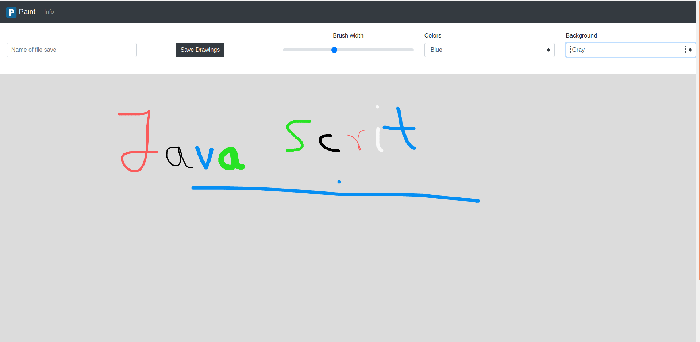
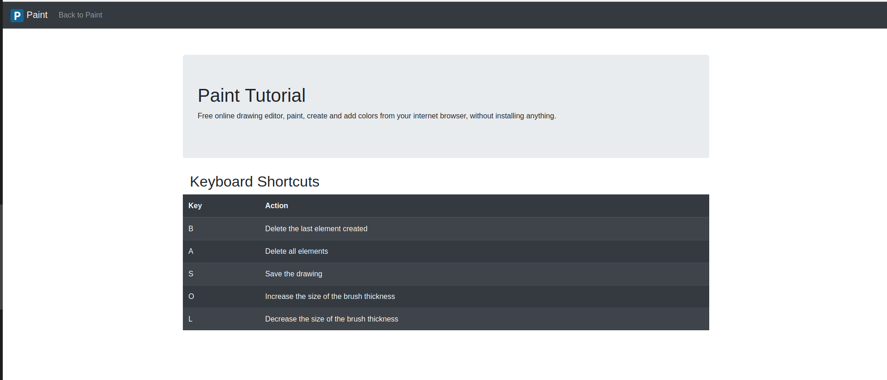

# Paint-P5js


## Autor
Miguel Ángel Medina Ramírez <br>
Correo: miguel.medina108@alu.ulpgc.es

## Indice
1. [Introducción](#introducción)
2. [Dependencias](#dependencias)
3. [Implementación](#implementación) <br>
    3.1 [Dibujos y JavaScript](#dibujos-y-javascript)<br>
    3.2 [Html](#html)
4. [Eventos](#eventos)
5. [Bibliografía](#bibliografía)

## Introducción
El objetivo de esta práctica es diseñar una aplicación web parecidas a la aplicación de consola de windows *Paint*, pero haciendo uso de P5js una librería de JavaScript para usar directivas de dibujos y modelo de objetos propias de processing.

## Dependencias
Al tratarse de una aplicación web, la única dependencia que se necesita para ejecutar el proyecto es un **navegador** o cualquier otro programa capaz de ejecutar html.

## Implementación

Como se trata de javascript todo el código está orientado a funciones y se ha hecho uso del framework **JQuery** para que la integración de html con javascript sea más sencilla.

### Dibujos y JavaScript

Para lograr una efecto similar al Paint original, y poder permitir que el usuario pueda crear cualquier dibujo en 2D, se ha planteado el siguiente algoritmo:
 
* Como la interacción usuario-máquina es fundamentalmente con el ratón, cada vez que se pulse clic izquierdo y se mueva el ratón se registra un elemento, que está compuesto por los puntos del ratón en el movimiento, un color y la anchura del pincel.
 
* En cada iteración del *draw* se recorren los elementos creado y se pintan.
 
* Para hacer los dibujos se ha optado por dibujar líneas entre los puntos del ratón recogidos, de esa forma el costo computacional del dibujo es pequeño al no ser necesario ningún proceso de interpolación, y el efecto es muy parecido al del paint original.

```javaScript
function paint() {
    drawings.forEach(element => {
        if (element.points.length == 1) {
            const initialPoint = element.points[0]
            stroke(element.color);
            strokeWeight(element.width);
            point(initialPoint[0], initialPoint[1]);
            return;
        }
        for (let index = 0; index < element.points.length-1; index++) {
            const initialPoint = element.points[index];
            const secondPoint  = element.points[index+1];
            stroke(element.color);
            strokeWeight(element.width);
            line(initialPoint[0], initialPoint[1], secondPoint[0], secondPoint[1]);
        }
    });
}

function mousePressed(){
    if (mouseButton == RIGHT) return;

    isDrawing = true;
    drawings.push({
        "points" : [[mouseX,mouseY]],
        "width"  : thickness,
        "color"  : paintColor,
    });
}

function mouseDragged(){
    drawings[drawings.length - 1].points.push([mouseX,mouseY]);
}

function mouseReleased(){
    isDrawing = false;
}
```

Aparte con **JQuery** se ha hecho toda la interfaz html-javascript, el usuario puede guardar sus creaciones, gracias a la directiva de **P5js** *saveCanvas*

```javaScript
    $(document).ready(function(){
        $("#sliderWidth").change(function(){
            thickness = $(this).val();
        });

        $("select").change(function () { 
            paintColor = chooseColor($("#colors").val());  
        });

        $("#saveButton").click(function (e) { 
            e.preventDefault();
            saveDraw();
        });
    });
```

### Html

Existen dos archivos .html en este proyecto, el primero es donde se implementa el paint, y donde el usuario podrá:
 
* Dibujar y borrar sus creaciones.
 
* Guardar las nuevas figuras creadas.
 
* Cambiar tanto el grosor del pincel como los colores de este y del fondo.

<p align="center">
  
</p>
<p align="center">
  Figura 1: Imagen de muestra del index.html
</p>

El segundo donde se expone una explicación del trabajo y una guia de los atajos de teclado:

<p align="center">
  
</p>
<p align="center">
  Figura 1: Imagen de muestra del info.html
</p>

## Eventos
<table>
    <thead>
        <tr>
        <th>Tecla</th>
        <th>Acción</th>
        </tr>
    </thead>
    <tbody>
        <tr>
        <td>B</td>
        <td>Borra el último elemento creado</td>
        </tr>
        <tr>
        <td>A</td>
        <td>Borra todos los elementos</td>
        </tr>
        <tr>
        <td>S</td>
        <td>Guarda el dibujo</td>
        </tr>
        <tr>
        <td>O</td>
        <td>Incrementa la anchura del pincel</td>
        </tr>
        <tr>
        <td>L</td>
        <td>Decrementa la anchura del pincel</td>
        </tr>
    </tbody>
</table>

## Bibliografía

* [Guion de prácticas](https://cv-aep.ulpgc.es/cv/ulpgctp20/pluginfile.php/126724/mod_resource/content/22/CIU_Pr_cticas.pdf)
* [processing.org](https://processing.org/)
* [P5js](https://p5js.org/es/)
